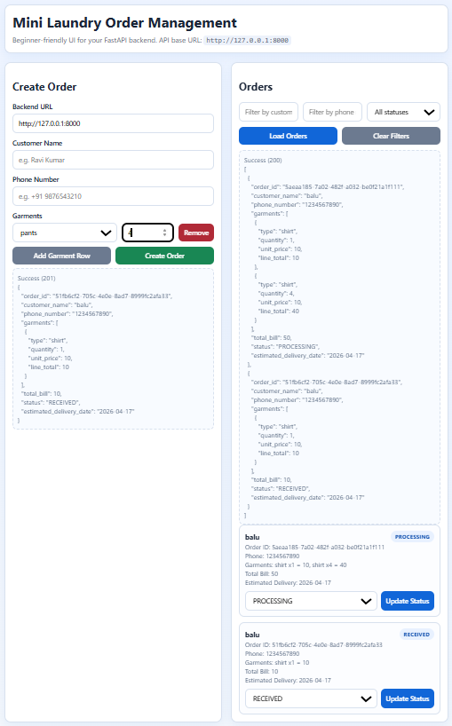
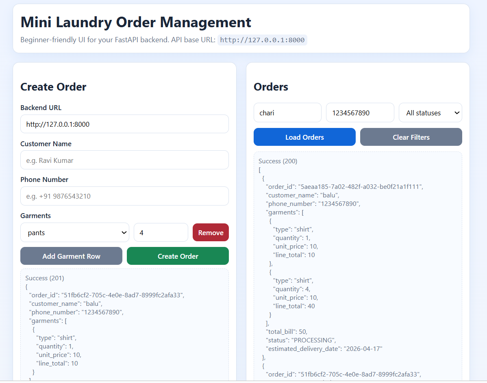
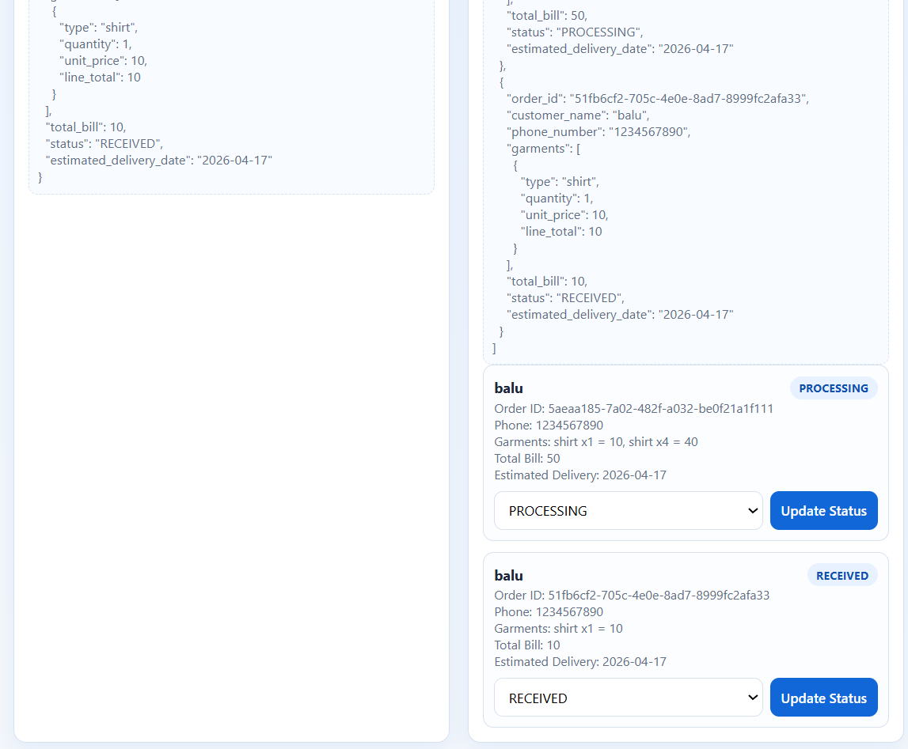
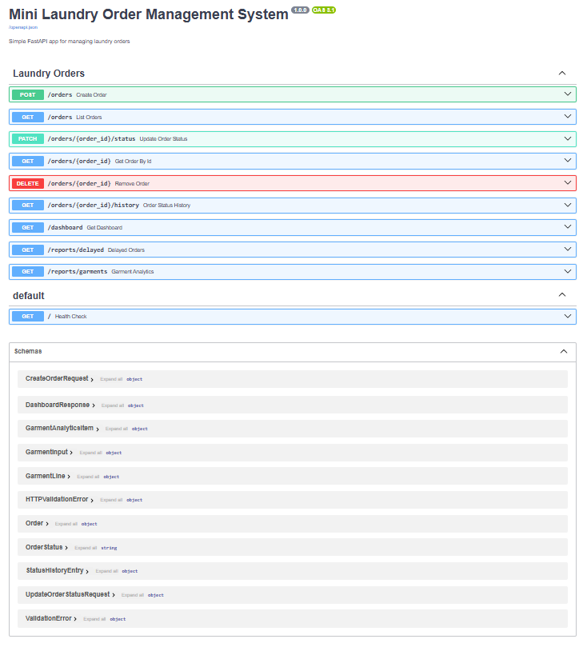
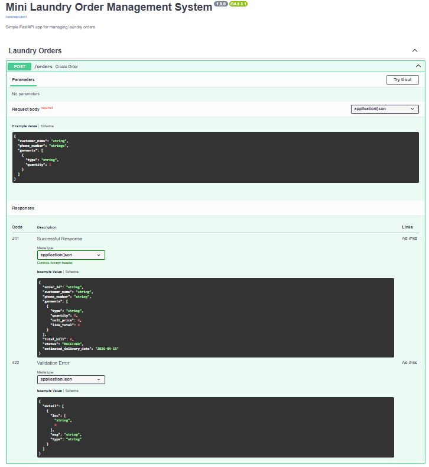
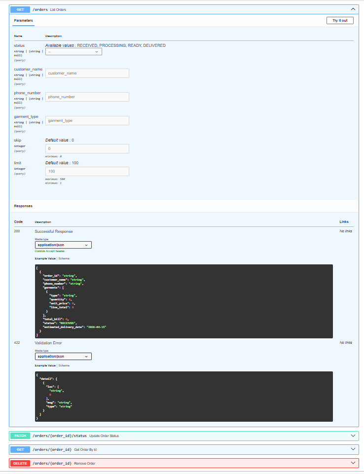

# Mini Laundry Order Management System

## Evaluation Alignment
This section maps the delivered work to the evaluation criteria.

### 1) Speed and Execution
- Built a working API-first system quickly with core flows completed first: create order, update status, list/filter orders, and dashboard.
- Kept implementation scope focused so the system remained runnable and testable end-to-end.

### 2) AI Leverage
- Used AI tools (ChatGPT and GitHub Copilot) to rapidly scaffold routes, models, tests, and documentation.
- Used AI for acceleration, then manually validated outputs and corrected issues.

### 3) Problem Solving
- Resolved Python environment compatibility issue (Python 3.15 alpha dependency build failure) by validating and running on Python 3.13.
- Replaced deprecated FastAPI startup pattern with lifespan-based startup to remove warnings.
- Added optional SQLite mode while preserving in-memory behavior as default.

### 4) Code Quality (Practical)
- Readable structure: main, models, routes, storage, tests.
- Logical API design and validation with clear error responses.
- Avoided unnecessary abstractions and over-engineering.

### 5) Ownership Mindset
- Went beyond minimum requirements by adding:
	- Optional SQLite persistence
	- Automated tests
	- Simple frontend for manual testing
	- Professional documentation and sample requests

### What Was Intentionally Avoided
- No unnecessary architecture layers or complex patterns.
- No heavy frontend framework or fancy UI focus.
- No speculative features outside project scope.

## 1) Project Overview
Mini Laundry Order Management System is a backend-focused application for managing laundry orders with clean REST APIs built using FastAPI. The system supports order creation, status tracking, filtered order listing, and dashboard metrics.

The project is designed to be simple, readable, and practical for learning and demonstration. It includes in-memory storage by default and optional SQLite persistence.

## 2) Features Implemented
- Create Order API
	- Accepts customer_name, phone_number, and garments list.
	- Uses fixed garment pricing:
		- shirt: 10
		- pants: 15
		- saree: 20
	- Automatically calculates total_bill.
	- Generates unique order_id.
	- Sets default order status to RECEIVED.
	- Adds estimated_delivery_date as current date + 2 days.
- Update Order Status API
	- Allowed statuses: RECEIVED, PROCESSING, READY, DELIVERED.
	- Updates status by order_id.
	- Enforces valid transition flow: RECEIVED -> PROCESSING -> READY -> DELIVERED.
	- Returns proper error when order_id is invalid.
- View Orders API
	- Returns all orders.
	- Supports filters by status, customer_name, phone_number, and garment_type.
	- Supports pagination via skip and limit.
- Get Order by ID API
	- Returns one order by order_id.
- Delete Order API
	- Deletes one order by order_id.
- Order Status History API
	- Tracks every status change with timestamp.
- Delayed Orders Report API
	- Returns non-delivered orders whose estimated delivery date has passed.
- Garment Analytics Report API
	- Returns garment-wise total quantity and total revenue.
- Dashboard API
	- Returns total number of orders.
	- Returns total revenue.
	- Returns count of orders grouped by status.
- Quality and Validation
	- Pydantic models for request and response validation.
	- Input validation for garment types and phone format.
	- Clear HTTP error handling.
	- Automated tests for key flows.

## 3) Tech Stack
- Python 3.13
- FastAPI
- Pydantic
- Uvicorn
- SQLAlchemy (optional SQLite mode)
- Pytest + FastAPI TestClient

## 4) Setup Instructions
Prerequisites
- Python 3.13 recommended

Install dependencies
- py -3.13 -m pip install -r requirements.txt

Run the API (default in-memory storage)
- py -3.13 -m uvicorn main:app --reload

Open API docs
- http://127.0.0.1:8000/docs

Optional SQLite mode
- PowerShell:
	- $env:STORAGE_BACKEND="sqlite"
	- py -3.13 -m uvicorn main:app --reload

Run tests
- py -3.13 -m pytest -q

## Quick Demo (2 Minutes)
1. Start the API:
	- py -3.13 -m uvicorn main:app --reload
2. Open Swagger docs:
	- http://127.0.0.1:8000/docs
3. Create one order using POST /orders.
4. Update status using PATCH /orders/{order_id}/status in sequence:
	- RECEIVED -> PROCESSING -> READY -> DELIVERED
5. Verify results using:
	- GET /orders
	- GET /dashboard
	- GET /orders/{order_id}/history
6. Open the simple frontend:
	- http://127.0.0.1:8000/ui

## 5) API Endpoints List
Base URL
- http://127.0.0.1:8000

Health
- GET /
	- Description: Service health check.

Create Order
- POST /orders
	- Description: Creates a new order and calculates bill.

Update Order Status
- PATCH /orders/{order_id}/status
	- Description: Updates status of an existing order with guarded flow (RECEIVED -> PROCESSING -> READY -> DELIVERED).

Get Order by ID
- GET /orders/{order_id}
	- Description: Returns one order by id.

Delete Order
- DELETE /orders/{order_id}
	- Description: Deletes one order by id.

Order Status History
- GET /orders/{order_id}/history
	- Description: Returns status transition history for an order.

View Orders
- GET /orders
	- Optional query params:
		- status
		- customer_name
		- phone_number
		- garment_type
		- skip
		- limit
	- Description: Returns all orders or filtered orders.

Dashboard
- GET /dashboard
	- Description: Returns total orders, total revenue, and status-wise counts.

Delayed Orders Report
- GET /reports/delayed
	- Description: Returns orders delayed beyond estimated delivery date.

Garment Analytics Report
- GET /reports/garments
	- Description: Returns garment-wise totals (quantity and revenue).

Sample HTTP requests are available in sample_requests.http.

## 6) AI Usage Report
### Tools Used
- ChatGPT
- GitHub Copilot

### Sample Prompts
- Build a complete Mini Laundry Order Management System using FastAPI with order creation, status updates, filtering, and dashboard metrics.
- Add optional SQLite persistence while keeping in-memory storage as default.
- Create simple frontend in HTML, CSS, and JavaScript using fetch for API integration.
- Generate clean README with architecture, setup, endpoints, tradeoffs, and roadmap.

### Where AI Helped
- Produced initial project scaffolding quickly.
- Accelerated boilerplate creation for FastAPI routes and Pydantic models.
- Suggested clean request/response schemas and enum-based status handling.
- Helped create automated test cases and sample request files.
- Improved documentation quality and structure.

### Where AI Failed or Needed Correction
- Initial dependency assumptions did not account for Python 3.15 alpha compatibility.
- Some generated sections required simplification for readability.
- Lifecycle hook needed adjustment to remove FastAPI deprecation warnings.

### What I Improved Manually
- Standardized project structure and flow.
- Added optional SQLite backend while preserving memory mode.
- Fixed compatibility/testing workflow by validating on Python 3.13.
- Refined error handling and response clarity.
- Cleaned up startup handling and verified test stability.

## 7) Tradeoffs
- In-memory storage is simple and fast for demos but data is lost on restart.
- SQLite mode improves persistence but remains single-node and local-file based.
- No authentication/authorization was added to keep scope focused and beginner-friendly.
- Business rules are intentionally minimal to keep implementation clean and testable.

## 8) Future Improvements
- Add authentication and role-based access control.
- Add order history/audit logs for status transitions.
- Add Docker support for easy deployment.
- Add CI workflow for automated tests and lint checks.
- Add richer analytics (daily revenue, peak order times, garment trends).
- Serve frontend directly from FastAPI static files.

## Screenshots

### Frontend

### Swagger API Docs

